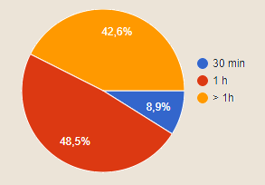
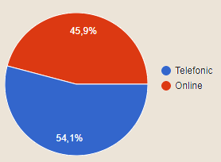
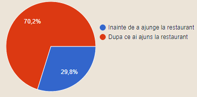
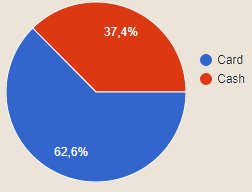
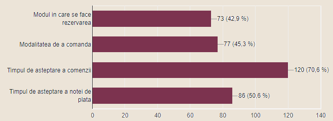

### Validare client

- Cat timp petreci la restaurant (durata unei mese) ?

- Cum preferi sa faci rezervarea ?

- Cand ai vrea sa comanzi?

- Cum preferi sa achiti nota de plata?

- Ce consideri ca ar putea fi imbunatatit ?

- Cu ce te-ai confruntat atunci cand ai ales sa servesti masa intr-un restaurant? Ce imbunatatiri ai aduce sistemului de rezervare si celui de preluare a comenzii ?

>- personal necooperativ
>- Personalul să fie mai operativ.
>- Servire greoaie, ospătari plictisiți, timpul mare de așteptare pana Primești nota de plata
>- Atitudinea si comportamentul ospatarilor lasa uneori multe minusuri unui restaurant chiar daca mancarea este foarte buna. Sistemul de rezervare este ok, preluarea comenzii uneori este gresita. Apreciez restaurantele unde comenzile sunt preluate pe telefon/aplicatii si imediat alta persoana iti aduce bauturile, iar comanda merge direct la bucatarie.
>- As introduce meniul pe tableta/dispozitiv mobil pe fiecare masă astfel încât clienții să poate comanda când sunt hotărâți, fără sa fie nevoie sa aștepte un ospătar. Comanda va merge direct pe dispozitivul mobil din bucătărie, notificand bucătarul.
>- As prefera ca preluarea comenzii sa se poata face printr-un dispozitiv (disponibil pentru fiecare masa) prin care clientul isi poate comanda singur mancarea/bautura si de asemenea meniul sa fie disponibil pe acelasi dispozitiv
>- Rapiditate..
>- Am primit foarte greu meniul pentru a comanda si nota de plata la final. Mi-ar placea sa pot rezerva o masa la restaurant, asemenea rezervarilor pentru film (alegerea locurilor in sala de cineva) ar fi util pentru restaurantele cu view-uri frumoase
>- Modul de servire
>- A durat prea mult sa primesc meniul, sa mi se aduca bautura, apoi sa mi se aduca mancarea. Mi-ar placea sa exsite ceva ca acestea sa dureze mai putin
>- Desi mi s-a luat comanda imediat, a durat mult pana mi s-a servit mancarea.
>- As face cumva ca, atunci cand iau masa de pranz in restaurant sa mearga totul ca pe roate, sa dau comanda repede, sa mi se aduca repede, iar imediat cum am terminat sa pot pleca inapoi spre birou.
>- A durat mult. Sa dureze mai putin
>- Lipsa de timp sau așteptarea îndelungată până să fie gata comanda.
>- Factorul uman >- chelneri care nu iau comanda la timp, sau vin prea repede când nici nu ai terminat de răsfoit meniul.
>- Aplicație de pe care să faci comanda și chelnerul o aduce când e gata.
>- Din când in când se mai greșește comanda ;in anumite cazuri personalul 
>- Mi-ar place o mai buna rapidate intre a prelua comanda si preluarea notei de plata .
>- As fi preferat ca atunci cand ma grabesc sa existe un mod in care lucrurile sa se desfasoare mai rapid. La orele aglomerate poti sfarsi mergand la mai multe restaurante pana cand ajungi sa gasesti o masa libera. Dureaza mult pana este gata mancarea.
>- Nu aveau mese disponibile, dura extrem de mult sa ne ia cineva comanda, sa ajunga comanda si sa vina nota
>- Cu durata de asteptare foarte mare, chiar si cu nerespectarea comenzii ( fiind nevoit sa rog iar chelnerul sa imi aduca ceva ce zisesem initial) Ca imbunatatire: sa existe o aplicatie pt tableta care sa contina mesele din restaurant, iar cel care te serveste sa noteze tot acolo ce ai comandat, apoi sa organizeze comenzile dupa rapiditatea prepararii, dar si ordinea comenzilor, intr-un mod cat mai eficient
>- Faptul că în România nu există o aplicație care să îți facă split bill, așa cum există în alte țări, adică să ai posibilitatea ca toată lumea să plătească cu cardul partea lui/ei. Ca și rezervări, ar fi frumos să existe ceva online în care să vezi ce locuri sunt libere sau nu și să poți să îți alegi tu masa și să suni să rezervi. La comandă ar fi mult mai simplu dacă ar fi ceva electronic în care toată lumea să își aleagă ce vrea și să poți să dai ceva gen finalizare comandă, fără să îți vină oamenii de acolo să te tot întrebe dacă te-ai hotărât.
>- Aproape niciodată nu știu cum arată mâncarea pe care o comand
>- Notarea comenzii pt a evita eventualele greseli care se fac prin metoda “tin eu minte”, estimarea timpului in care va veni comanda in fctie de complexitate si de comenzile anterioare, imbunatatirea timpului de asteptare (pt meniu, pt preluarea comenzii, pt nota de plata)
>- Ar putea fi facuta comanda prin intermediul unei tablete de exemplu, deoarece timpul de asteptare pana se aduce meniul si pana se întoarce chelnerul sa ia comanda uneori este destul de lung, chiar si atunci cand nu sunt multe persoane.
>- Cea mai mare problemă cu care m-am confruntat a fost faptul ca restaurantele nu mai aveau ce se cerea. Ex: prajitura cu capsuni. Sistemul de rezervare mi se pare in regula atat telefonic dar si online, iar in ceea ce privește preluarea comenzii mi-ar placea ca cei care iau comanda sa fie mai primitori si zambareti. Mult spor in ce v-ati propus!
>- Durează prea mult pana vine mancarea atunci când îmi este foame. 👌🏻
>- Durata mare de asteptare a chelnerului sa pot comanda. Ar fi fain sa poti comanda direct din aplicatie si comanda sa ajunga direct la bucatar/chelner.
>- Timpi mari de asteptare pana la servire pentru ca nu intotdeauna exista meniul online ca sa cunosti (toate) optiunile. Incurcarea comenzilor de catre. chelneri. Ar fi frumos sa existe o harta a meselor in restaurant (eventual sa precizeze care e langa geam etc) cate locuri per interval orar daca este libera ori deja rezervata (ceva in real time). Sa poti comanda dinainte de a ajunge ca sa nu fii nevoit sa astepti o ora (mai alea cand sunt multe persoane in pauza de masa din timpul programului la munca). Sa ti se spuna in cat timp ar fi gata mancarea(in functie de preparat banuiesc) ca sa stii cand poti merge sa o servesti fara sa astepti (exagerat de mult macar).
>- Timpul de asteptare pana vine mancarea si lipsa unor produse din bucatarie care apar pe meniu
>- Sa fiu anunțat cât durează
>- O data, timpul de asteptare intre Fel Principal si Desert a fost de aproape jumatate de ora... Consider ca este enorm.
>- Comanda trebuie adaugata pe loc intr-o aplicatie de pe telefonul mobil in momentul in care se da. Rezervarea online sau telefonic.
>- Notarea precisa a rezervarii, deoarece de multe ori cei care preluau apelul telefonic nu notau ora si numarul de persoane iar apoi uitau, asadar cand ajungeam acolo ne trezeam fara rezervare.
>- Timp lung de asteptare cand vrei sa comanzi, in special la pranz/seara; ca imbunatatiri, modalitate online de a rezerva o masa/de a vedea meniul si de a comanda; posibilitatea de a vedea gradul de ocupare intr-un anumit interval de timp
>- Uneori a durat foarte mult să se ia, respectiv să se aducă ce s-a comandat.
>- Timpi mari de asteptare
>- Platforma online pentru toate restaurantele
>- Chelnerii ar trebui să fie mai atenti cu clienții
>- Să putem face comanda în mod electronic
>- Rezervare online cu alegerea mesei, preluarea si gatirea comenzii inainte de a ajunge in restaurant
>- Amabilitatea chelnerilor.
>- Lipsa unei metode de rezervare online pentru aproape oricare restaurant, timpul de așteptare foarte mare, indisponibilitate unor produse prezente în meniu.
>- sa fie mai rapide
>- Depinde de restaurant și de tipul de service pe care îl marketizeaza. Atâta timp cât așteptările sunt setate ca e un fast food unde trebuie sa stai la coada și sa îți debaraseze masa singur, nu ma deranjează. Dar dacă e un restaurant cu preturi mari, ma aștept ca totul sa fie servit impecabil. De asemenea consider ca orice restaurant trebuie sa aibă poze cu felul de mâncare propus.
>- Întârziere uneori. 
>- Timpul de asteptare al preparatelor
>- Timpul de așteptare până la preluarea comenzii; dificultăți în împărțirea notei de plată cand cineva a solicitat acest lucru
>- Cea mai buna modificare care se poate aduce este eficientizarea personalului (in sensul de a nu se face rabat de la personal si de la calitatea lor), deoarece un client pune cel mai mult accent ca a sa comanda sa fie luata repede, sa fie preparata bine (nu in bataie de joc) si sa poata sta in tihna. Daca un client nu va vedea "ambiantul" locului si nu va lua contact cu meniul si cu personalul, nu il va ajuta deloc sa dea comanda inainte sa ajunga acolo, deoarece se poate si razgandi.
>- Timpi foarte decalati.
>- Mergeam intr-un restaurant si de cele mai multe ori nu gaseam o masa disponibila.
>- Dureaza foarte mult pana astepti comanda si nota de plata
>- Preluarea comenzii este intarziata. As vrea sa scurteze timpul de asteptare la preluarea comenzii.
>- Durata mai mică la preluarea și pregătirea comenzii care ar putea fi diminuat destul de mult dacă s-ar putea face comenzile dinainte, și să fie preparate până ajungem. Unele localuri permit, însă sunt prea puține. Dacă ar putea fi și o opțiune online de a rezerva și comanda ar fi mai mult decât perfect.
>- Panou pentru comenzi (comanda, nota, etc) la fiecare masa
>- Sa pot rezerva online pentru cati membri doresc, sa pot alege locul in restaurant si timpul de asteptare a notei de plata sa nu fie uitat.
>- O aplicatie a restaurantului, in care sa se regaseasca meniul si modalitate de a cere comanda

